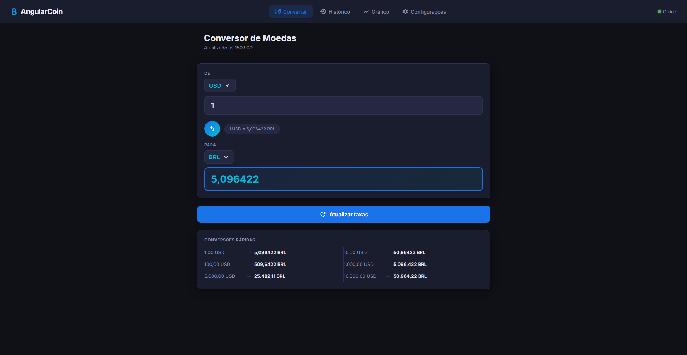
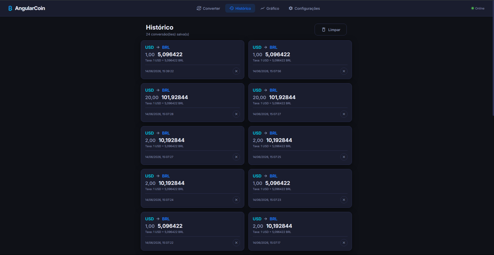
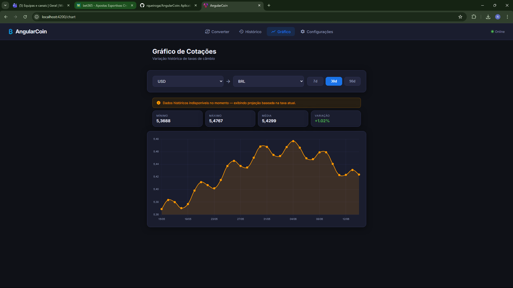

# AngularCoin 💱

Aplicativo de conversão de moedas em tempo real desenvolvido com Angular 17 para a disciplina de Desenvolvimento Web.

A ideia do projeto surgiu da necessidade de criar algo útil usando Angular e consumo de APIs REST. Decidi fazer um conversor de moedas porque é algo que uso no dia a dia e achei que seria interessante implementar do zero.

---

## Sobre o projeto

O AngularCoin permite converter valores entre diferentes moedas usando taxas de câmbio atualizadas em tempo real. A aplicação foi construída pensando em ser simples de usar, com uma interface limpa e responsiva que funciona bem tanto no celular quanto no computador.

Usei a [Frankfurter API](https://www.frankfurter.app) para buscar as taxas de câmbio — ela é gratuita, open source e não precisa de chave de API, o que facilitou bastante o desenvolvimento.

---

## Telas do projeto

### Tela principal — Conversor

É a tela central do app. O usuário seleciona as moedas de origem e destino, digita o valor e a conversão acontece automaticamente. Tem um botão de swap para inverter as moedas com um clique e uma tabela de conversões rápidas para valores comuns.



### Histórico de conversões

Todas as conversões ficam salvas no Local Storage do navegador. O usuário consegue ver o histórico completo, remover entradas individuais ou limpar tudo de uma vez. Achei importante ter isso para não precisar reconverter os mesmos valores toda hora.



### Gráfico de variação cambial

Uma das partes que mais gostei de implementar. Usei o Chart.js para exibir um gráfico de linha com a variação da taxa de câmbio nos últimos 7, 30 ou 90 dias. Também calculei as estatísticas do período: mínimo, máximo, média e variação percentual.



---

## Funcionalidades implementadas

- Conversão em tempo real entre mais de 30 moedas internacionais
- Busca de moeda por código (USD, BRL, EUR...) ou nome completo
- Botão para inverter as moedas de origem e destino
- Histórico de conversões salvo localmente (últimas 100)
- Modo offline: se não tiver internet, usa as taxas em cache
- Gráfico histórico com estatísticas do período selecionado
- Tabela de valores rápidos (1, 10, 100, 1000...)
- Tela de configurações para definir moedas padrão e frequência de atualização das taxas

---

## Como rodar o projeto

**Pré-requisitos:** Node.js 18 ou superior instalado

```bash
# Clone o repositório
git clone https://github.com/SEU_USUARIO/AngularCoin.git
cd AngularCoin

# Instale as dependências
npm install

# Rode o servidor de desenvolvimento
npm start
```

Após isso, acesse `http://localhost:4200` no navegador.

Para gerar a build de produção:

```bash
npm run build
```

---

## Tecnologias utilizadas

- **Angular 17** com Standalone Components (sem NgModules)
- **TypeScript 5.4**
- **Chart.js 4** para o gráfico histórico
- **Frankfurter API** para as taxas de câmbio
- **Local Storage** para histórico e cache offline
- **SCSS** para os estilos

---

## Estrutura de pastas

```
src/
└── app/
    ├── models/          # interfaces TypeScript (Conversion, Currency, Settings)
    ├── services/
    │   ├── currency.service.ts   # chamadas à API e lógica de conversão
    │   ├── storage.service.ts    # leitura e escrita no Local Storage
    │   └── settings.service.ts  # gerencia as preferências do usuário
    └── pages/
        ├── converter/   # tela principal
        ├── history/     # histórico de conversões
        ├── chart/       # gráfico de variação
        └── settings/    # configurações do app
```

---

## API utilizada

A [Frankfurter API](https://www.frankfurter.app) é gratuita e não requer cadastro ou chave de acesso. Os endpoints que usei foram:

- `GET /currencies` — lista todas as moedas disponíveis
- `GET /latest?from=USD` — taxas atuais a partir de uma moeda base
- `GET /2024-01-01..2024-12-31?from=USD&to=BRL` — variação histórica entre duas datas

---

## Critérios do projeto

| Critério | Status |
|---|---|
| Angular 17 + TypeScript | ✅ |
| Consumo de API REST externa | ✅ |
| Interface responsiva e intuitiva | ✅ |
| Histórico com Local Storage | ✅ |
| Suporte a várias moedas com busca | ✅ |
| Atualização automática de taxas | ✅ |
| Conversão inversa (swap) | ✅ |
| Funcionalidade offline | ✅ |
| Gráfico de variação histórica | ✅ |
| Opções de configuração | ✅ |
| .gitignore sem node_modules | ✅ |
| LICENSE MIT | ✅ |

---

## Licença

MIT — veja o arquivo [LICENSE](LICENSE).
